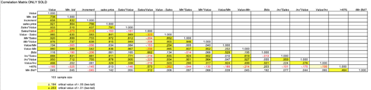
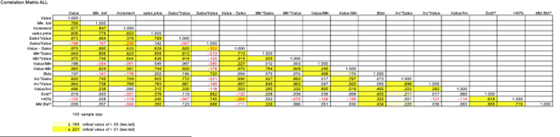
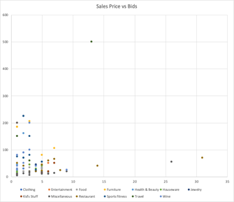
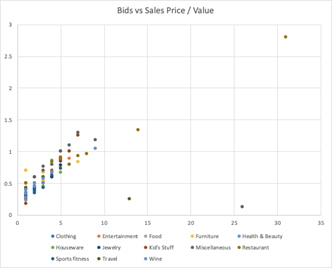
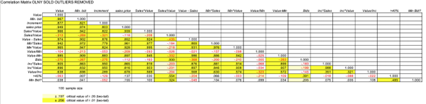

# Some notes on questions about the impact or effect of Min. bid and Increment
To address questions of impact we will need to develop relational models. In principle, we expect that sales price and bids are affected by value, min bid, and increment. Let’s assume that these are independent of Category. This is probably not a very good assumption but useful for simplifying the analysis and we can reconsider this if we do not get good enough results. Start by describing the effects. A correlation analysis is a good place to start.  Look at various combinations of the variables to help identify interactions and relative effects of parameters (e.g. value):

  
  

Highlighted cells have non-zero correlation* with p-value less than 0.05 (at least 95% confidence). To start the correlation analysis, try to interpret the correlations above and if the correlation is expected and desired.  

*Note: correlations here only indicate possible linear (proportional) relationships! You may observe unexpected correlation due to non-linearity, interactions (another variable effects the relationship), or outliers. For example in principle we would expect sales price to be positively correlated with bids, but we observe a sample correlation of 0.116 which is non-significant. Looking at the scatterplot we clearly see an interaction possibly with value or category. Looking at the scatter plot of sales price vs bids colored by category we do not see any obvious groups (modes):
 

However, looking at bids vs sales price / value reveals an interaction (note some clear outliers):

Advice is to always look at the scatterplot to see if the relationship matches in principle and do not judge only from the sample correlation! You may need to consider various transformations of the data or other derived variables (combinations) to find a reasonably linear relationship. If you cannot find a linear relationship, then the analysis will be more difficult (but possible still)!  

**Watch out for Outliers!** Keep in mind that an outlier can dramatically affect the sample correlation and give unreliable estimates (e.g. making correlation significant when it isn’t). When judging an outlier, if the data is not needed or “representative”  you can remove it. In the case of outliers in derived data (such as Bids or filling in missing values) you can revisit the assumptions used and adjust them to eliminate. For example, setting the Min. bid to the Min bid to comparable value items rather than 0 for missing values.

**Correlations between controllable variables and independent variables (controllable to otherwise) indicate practices/policy**  

Min Bid and Increment are controllable variables because the values can be chosen according to policy/practice and Value is generally an independent variable (although not controllable directly) since it is not inherently dependent on any other variables except maybe category.  

Example: We see a strong positive correlation between Min Bid and Value (0.768) which is evidence of a policy that the higher the value of an item, the higher the minimum bid is set. This does not say anything about the effect (or performance) of this policy other than providing evidence that it was practiced.

**Correlations between controllable variables and uncontrollable (dependent) variables indicate effects of practices/policy**
Example: We see a strong positive correlation between Min Bid and Sales price (0.895) which indicates that increases in Mid Bid tend to result in higher sales price. This provides evidence that the effect of the policy of setting higher minimum bids for higher-value items resulted in higher sales prices. However, this cannot be concluded as the cause since higher-value items tend to have higher selling prices (0.921 correlation). 

Curiously, while more bids do seem to correlate with higher sales price, a higher value / min bid does not seem to result in higher sales price, which indicates that setting a low min bid to encourage an increase in the number of bids may not help increase sale price. Is it better to just set a higher minimum bid?

**Correlations between uncontrollable variables indicate general effects**

Example: We see a strong positive correlation between Sales price / value and bids (0.71) which indicates that the more bids an item gets, the larger the sales price / value. We also see that we are more likely to get more than 40% sales price / value.

**Correlations with dummy variables indicate likelihood (frequency but not probability) relationships:**

Example between numerical variable and dummy variable: We see a significant moderately weak positive correlation (0.39) between sales price and Min Bid Achieved?  Interpretation -  If the likelihood that the min bid is achieved increases, then the sales price increases. If we believe this is a casual relationship, we would say that encouraging the min bid to be achieved will increase the sales price..

Example between dummy variable and dummy variable: We see a significant moderate positive correlation (0.715) between Min Bid Achieved? and >40%. Interpretation -  If the likelihood that the min bid is achieved increases, the likelihood that sale price will be more than 40% of the value increases. If causal,  encouraging the min bid to be achieved will increase the likelihood of getting more than 40%.

Use this kind of analysis in the following:  
1. describe bidding problems and extent of problems (usually using relationships between uncontrollable variables e.g. more bids imply higher sales price / value so want to encourage bidding ), decisions using relationships (usually using relationships between controllable and uncontrollable variables e.g. higher min bid implies higher sales value, but higher min bid decreases bidding, so how to set min bid not too high?), and questions (usually using relationships between controllable variables)
2. Use analytics to understand current practice (decisions) and outcomes/effects of practice especially expected and unexpected correlations (in both sign and significance)
3. Investigate how policy for controllable variables may affect outcomes of uncontrollable variables
